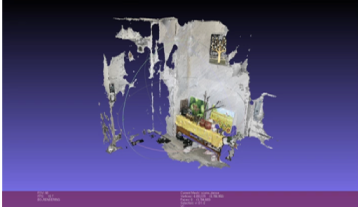
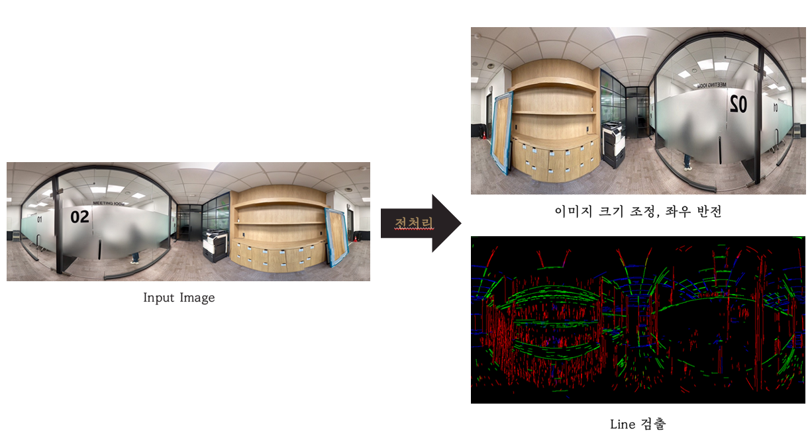
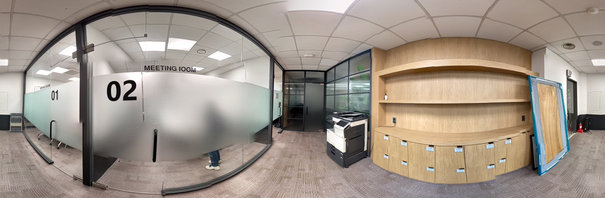
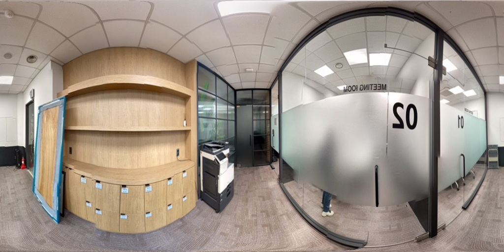

# 3D Room Reconstruction Using HorizonNet

### 2021.05.10(Mon) - 2021.06.11(Fri) / 길다영, 김현우 <br><br>

이 프로젝트는 2021-1 SSU Computer Vision 수업에서 진행됨.<br><br>

기존의 HorizonNet 논문과 코드를 해석하고, 직접 모델을 훈련시키고 이미지를 적용하여 3D Room을 복원해 봄.<br>
이곳에 사용된 모든 이미지들은 우리가 복원해본 과정에서 나타난 이미지임.<br><br>

## 목차
- [1. 프로젝트 진행 배경](#프로젝트-진행-배경)
- [2. 기대 효과](#기대-효과)
- [3. HorizonNet 설명](#horizonnet-설명)
- [4. 결과](#결과)
- [5. 문제점](#문제점)
- [6. 추후 계획](#추후-계획)
- [7. HorizonNet 훈련 및 테스트 과정](#horizonnet-훈련-및-테스트-과정)
 <br><br>
---
 <br><br>
## 프로젝트 진행 배경
 SFM으로 방을 3D로 복원하고자 함. 다양한 각도에서 촬영된 60장 이상의 사진을 사용했고 방을 구현하기까지 5~6시간의 시간이 소요됨.<br>
 </img>
 <br><br>
 그 결과, 다음과 같은 문제점이 나타남.
> - 유리가 제대로 인식되지 않음.
> - 방의 극일부만 구현됨.
> - 구현을 위해 다양한 각도에서 촬영한 무수히 많은 이미지가 필요함.
> - 조명에 영향을 많이 받음.
> - 시간이 많이 필요함.<br>
 
HorizonNet은 Manhattan World 가정을 기반으로 하여 짧은 시간에 방의 구조를 추측하는 방법으로 HorizonNet을 통해 이러한 문제점들을 해결할 수 있을 거라 판단함.
<br><br>

## 기대 효과
- 기존의 사진에는 왜곡이 심한 부분이 많고, 방 크기나 비율이 실제와 달라 보이는 경우가 많은데, 이러한 문제점을 개선하여 건축가 및 인테리어 디자이너, 혹은 이사를 위해 집 구조를 알아보는 사람들에게 도움이 될 수 있음. 

- 일반적인 RGB 카메라로 촬영된 파노라마 사진 한장으로 쉽게 3D Room을 구현할 수 있어, 많은 분야에 있어 용이할 것임.

- 만약 구현된 3D 모델에서 가구와 같은 디테일한 요소들을 보완할 수 있다면, 온라인 박람회나 온라인 집들이 등 가상현실의 배경을 구축하는 것에 도움이 될 것임.
<br><br>

## HorizonNet 설명
1. 수직 보정 전처리를 통해 1D Layout 표현<br>
> 입력으로 받은 파노라마 사진을 수직 보정하여 소실점과 edge를 찾는다.<br>
2. 특징 추출<br>
> ResNet50과 LSTM을 이용하여 훈련된 모델로 사진의 특징을 추출하여 천장-벽 경계, 바닥-벽 경계, 벽-벽 경계가 표시된 1D Layout을 도출한다.<br>
</img>
3. Post-Processing<br>
> Manhattan World 가정으로 바닥 천장, 벽면을 복구함.<br>
> 공식을 통해 천장-바닥 거리를 계산 -> 벽면 복구. <br>
</img>

(자세한 설명은 [최종 발표 자료.pdf](./최종%20발표%20자료.pdf)에 나타냄.)<br><br>

## 결과
한 장의 파노라마 이미지만을 사용해서 방을 3D로 복원할 수 있음.<br>
SFM으로 진행한 3D Reconstruction과 비교 시, 복원까지 적은 시간이 소요되었고 유리 또한 문제없이 복원됨.<br><br>

## 문제점
- 직사각형이 아닌 방의 경우 내부 구조가 제대로 구현되지 않음. 모든 벽면이 수직한다는 Manhattan World 가정의 근본적인 문제로 한 점에 대해 세 모서리가 직교하지 않는 공간에 대해서도 고려해야 함.<br>
- 테스트할 데이터셋이 부족함.<br><br>

## 추후 계획
- 직사각형이 아닌 방의 경우에도 내부 구조를 정확히 구현하도록 개선할 것.<br>
- 더 좋은 성능의 GPU를 사용하여 더 많이 데이터셋을 가지고 모델을 돌려볼 것.<br><br>

---
 <br><br>
## HorizonNet 훈련 및 테스트 과정
 - ["How to prepare your dataset?" 참고](https://github.com/sunset1995/HorizonNet/blob/master/README_PREPARE_DATASET.md) <br>
 
 ### 1. 파노라마 이미지 준비
 - [Google Street View](https://support.google.com/maps/answer/7011737?hl=ko) <br>
 </img>
  
 ### 2. 이미지 조정
 - 이미지 좌우 반전
 - 이미지 크기 변경 & 왜곡 보정 <br>
 ```python
 python preprocess.py --img_glob img/pic424.jpg --output_dir img/preprocessed --rgbonly
 ```
 &nbsp; &nbsp; &nbsp; &nbsp; </img>

 
 ### 3. Ground truth 텍스트 파일 및 데이터셋 준비
 - Ground truth 텍스트 파일 -> label_cor 내용
 - [디렉토리 구조](https://github.com/2021-1-SSU-Computer-Vision/3D_Room_Reconstruction/tree/main/ssu_dataset) <br>
 
 ### 4. 훈련 
 - batch_size_train: 1, epochs: 300, num_workers: 0 으로 진행함.
 ```Python
 python train.py --train_root_dir ssu_dataset/train --valid_root_dir ssu_dataset/valid --batch_size_train 1 --num_workers 0 --id model_bs1
 ```
 
 ### 5. 테스트
 - 테스트 전, 아래의 이미지들을 좌우반전해야 함.
 - 테스트 이미지1 <br>
 </img>
 - 테스트 이미지2 <br>
 </img>
 <br><br>

 ---

<br>

## 최종 완성물 <br>
* [최종 발표 자료.pdf](./최종%20발표%20자료.pdf)
* [프로젝트 제안서.pdf](./프로젝트%20제안서.pdf)
<br><br>

## 작성 순서<br>
1.  [HorizonNet 중간 발표.pdf](./HorizonNet%20해석/HorizonNet%20중간%20발표.pdf)
2.  [HorizonNet 논문 해석.pdf](./HorizonNet%20해석/HorizonNet%20논문%20해석.pdf)
3.  [HorizonNet 논문 해석2.pdf](./HorizonNet%20해석/HorizonNet%20논문%20해석2.pdf) <br><br>

------------------------------------------------------------------------- 
<br>

## 출처<br>
- [sunset1995/HorizonNet”(2019)](https://github.com/sunset1995/HorizonNet)
- [HorizonNet: Learning Room Layout with 1D Representation and Pano Stretch Data Augmentation (2019)](https://arxiv.org/abs/1901.03861) <br><br>


